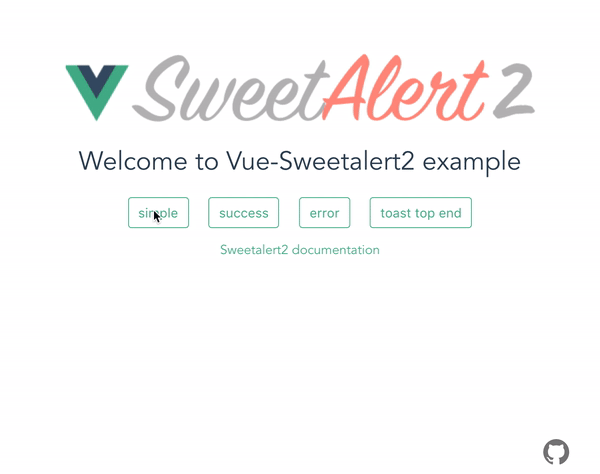

# vue-sweetalert2

[](https://www.npmjs.com/package/vue-sweetalert2)

[](https://coveralls.io/github/avil13/vue-sweetalert2?branch=master)

Vue.js wrapper for SweetAlert2. With support SSR.

---

## Attention:

When using "Vue3: Composition API" it is better **not to use** this wrapper.
It is more practical to call sweetalert2 directly.

Also, it is better to do it to get feedback faster, and be closer to the documentation.

---


# [Demo](https://avil13.github.io/vue-sweetalert2/)



---

## Get started

### Basics

```bash
# bash
npm install -S vue-sweetalert2
```

### Add types to TypeScript project

```js
{
  //...tsconfig.json
  "types": [
    "vue-sweetalert2"
  ],
}
```

## vue 2

```js
// main.js
import Vue from 'vue';
import VueSweetalert2 from 'vue-sweetalert2';

// If you don't need the styles, do not connect
import 'sweetalert2/dist/sweetalert2.min.css';

Vue.use(VueSweetalert2);
```

## vue 3

```js
// main.js
import { createApp } from 'vue'
import App from './App.vue'
import './index.css'

import VueSweetalert2 from 'vue-sweetalert2';
import 'sweetalert2/dist/sweetalert2.min.css';

const app = createApp(App)

app.use(VueSweetalert2);

app.mount('#app');
```

Now in the global object, you can access all the methods of [sweetalert2](https://github.com/limonte/sweetalert2).

```html
// example-vue-component.vue
<template>
  <button @click="showAlert">Hello world</button>
</template>

<script>
export default {
  methods: {
    showAlert() {
      // Use sweetalert2
      this.$swal('Hello Vue world!!!');
    },
  },
};
</script>
```

// Or

```js
Vue.swal('Hello Vue world!!!');
```

### Global options

If you want to add global options like button colors, do something like this:

```js
// main.js
import Vue from 'vue';
import VueSweetalert2 from 'vue-sweetalert2';

const options = {
  confirmButtonColor: '#41b882',
  cancelButtonColor: '#ff7674',
};

Vue.use(VueSweetalert2, options);
```

### Custom styling

Using scss styles are loaded so

```js
// main.js
import Vue from 'vue';
import VueSweetalert2 from 'vue-sweetalert2';

Vue.use(VueSweetalert2);
```

```scss
// style.scss
@import '~sweetalert2/src/variables';

$swal2-background: #990000;

@import '~sweetalert2/src/sweetalert2';
```

## Nuxt.js

Install dependencies:

```bash
npm install -S vue-sweetalert2
```

Add `vue-sweetalert2/nuxt` to modules section of `nuxt.config.js`

```js
{
  modules: ['vue-sweetalert2/nuxt'];
}
```

Or pass in global options like this:

```js
{
  modules: [
    [
      'vue-sweetalert2/nuxt',
      {
        confirmButtonColor: '#41b882',
        cancelButtonColor: '#ff7674'
      }
    ]
  ]
}
```

## The documentation for `sweetalert2`, you can find [here](https://sweetalert2.github.io/).
